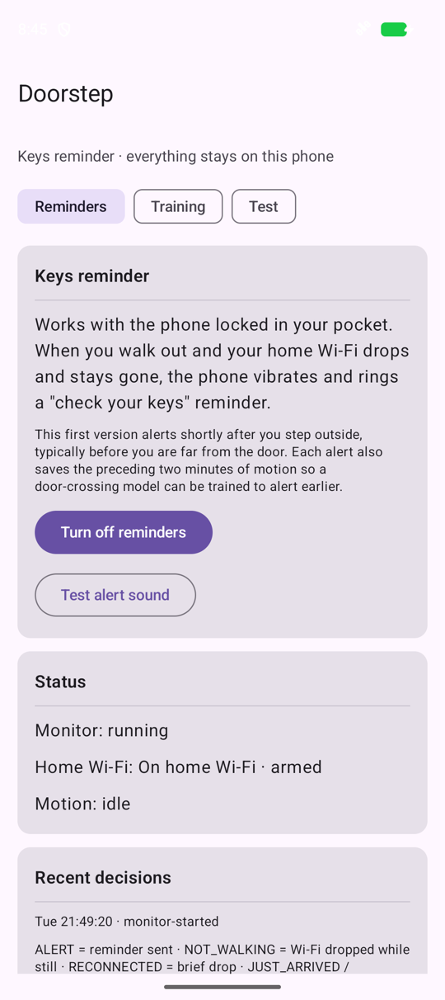
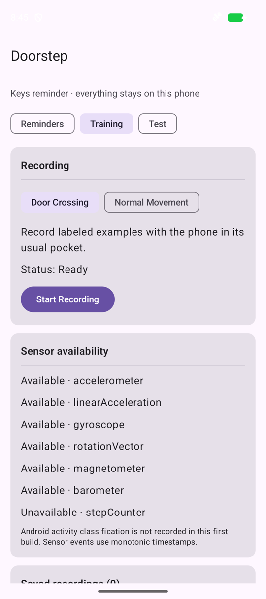
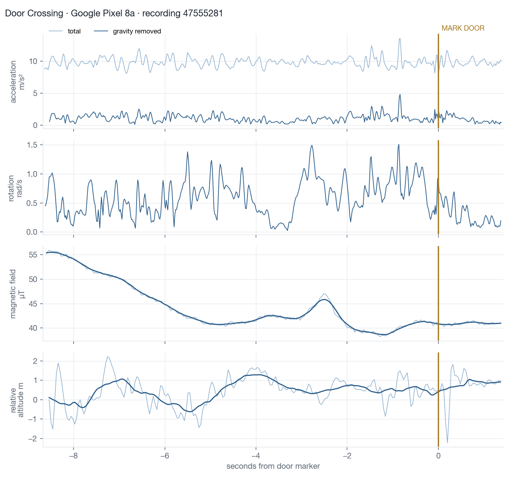

# 🔑 Doorstep

[](https://github.com/boii0boii/doorstep/actions/workflows/ci.yml)
[](LICENSE)

**Your phone taps you on the shoulder at the door, before you walk out without your keys.**
No tags, no beacons, nothing to stick on your keyring. Just the phone already in your pocket.

**[One-page project memo](https://claude.ai/artifact/4m6TwFnR47uz5YJkQtwmMw)** · **[How it's built](docs/ARCHITECTURE.md)**

<p>
  
  &nbsp;
  
</p>

## The 3-second problem

You grab your jacket, open the door, step out, and *click*, it shuts behind you. You pat your pocket. No keys.

Every lockout happens in the same few seconds at the door. A reminder that arrives after the door has closed is too late, so Doorstep has to buzz **while you're still inside**.

## The idea: learn how *you* leave

Leaving home has a rhythm. You walk down the hall, pause for shoes and a jacket, turn toward the door and reach for the handle. That rhythm shows up in your phone's motion sensors, even with the phone locked in your pocket.

Doorstep buzzes only when **three things agree**:

| | Signal | What it tells us |
|---|---|---|
| 🏠 | **You're on home Wi-Fi** | You're home, so this is a departure, not an arrival |
| 🚪 | **You're near your front door** | A GPS point you save once, standing at the door |
| 🚶 | **Your "leaving" pattern** | A small on-device model trained on *your own* walks to *your own* door |

```
 sofa ──walk──▶ hallway ──pause──▶ 🚪 door ──▶ outside ──▶ Wi-Fi drops
                              ▲                                 ▲
                   🔔 Doorstep buzzes here           safety-net reminder
                   (pattern + Wi-Fi + door)          (you're already out)
```

Why not just use GPS? Indoors, with the phone in your pocket, GPS is often off by 10–50 m. That's fine for "roughly at home, near the door" but not for pinpointing a doorway. That's why the motion pattern is what decides, and Wi-Fi and location only confirm it.

## The neat trick: the late signal trains the early one

Losing your home Wi-Fi is the one moment the phone knows *for sure* that you left. It's just too late to help, since you're already outside.

So Doorstep turns it into a teacher:

1. 📼 While you're home, the phone keeps a rolling 3-minute buffer of motion data, cheaply, with the screen off.
2. 📶 Wi-Fi drops while you're walking → you definitely just left.
3. 💾 Doorstep saves the 2 minutes *before* the drop. That clip contains your real walk to the door, **labelled automatically**. No buttons, no manual tagging.
4. 🙅 If it guessed wrong, tap **Not leaving** and the clip becomes a "not a departure" example.
5. 🧠 After a couple of weeks of normal life there's enough data to train the at-the-door model.

Meanwhile the same event sends a "did you forget your keys?" reminder as a safety net. It doesn't beat the door, but it beats getting to the station.

## Where it's at

| | |
|---|---|
| ✅ | Runs with the phone **locked in your pocket**, using a low-power foreground service. The CPU wakes only when you walk |
| ✅ | Tracks **home Wi-Fi** in the background |
| ✅ | **Saves your departures as labelled recordings**, and **Not leaving** marks false alarms |
| ✅ | **Safety-net reminder** when you leave, with guards against false alarms (router restarts, brief drops, just got home) |
| ✅ | **Door location** check, with accuracy reported honestly |
| ✅ | 26 tests, including **real Pixel recordings replayed** through the logic. CI runs them on every push |
| 🛠️ | **Next:** the leaving-pattern model, trained on the auto-collected departures |
| 🛠️ | **Then:** the at-the-door alert that combines all three signals |
| ⏳ | Real-world numbers (how early it buzzes, false alarms per day, battery use) come from a week on a real phone. Not measured yet |

## 📈 A peek at real data

A real 10-second walk through a front door, recorded on a Pixel 8a and lined up with the moment the door button was pressed:



Two things jump out:

- **Rotation settles right after the threshold.** The twisting of reaching, turning and opening stops once you're through.
- **The magnetic field shifts by about 14 µT on the approach.** Door frames, locks and wiring bend the magnetic field, and the phone can feel it.

It's one recording, so treat these as leads, not results. That's exactly what the pattern model will learn to pick up. The same data also turned up a gotcha: the Pixel's step counter reports steps about 10 s late, so Doorstep uses the faster step *detector* instead. ([samples](samples/README.md) · [plotting tools](ml/README.md))

## 🧰 Try it

You need Android Studio, or JDK 17 plus Android SDK 35. Use a real phone: an emulator can't walk.

```sh
cd android
./gradlew testDebugUnitTest   # run the tests
./gradlew assembleDebug       # build app/build/outputs/apk/debug/app-debug.apk
```

On the phone:

1. **Test** tab → save your home Wi-Fi, then stand at your front door and save the door point.
2. **Reminders** tab → **Turn on reminders**. For location, choose **Allow all the time**; Android hides the Wi-Fi name from background apps otherwise. Also allow physical activity, notifications and unrestricted battery use.
3. Live normally. Each departure becomes training data.

Want to poke at the data?

```sh
pip install -r ml/requirements.txt
python ml/report.py samples/recordings        # quality report
python ml/plot_recording.py samples/recordings/47555281-56fb-49db-8ef3-1739d444e497.json door.png
```

## 🗺️ What's where

```
android/   the app (Kotlin + Jetpack Compose), code in app/src/main/java/com/boii0boii/doorstep/
  monitor/   background departure monitor, Wi-Fi watcher, notifications
  capture/   screen-off training recorder
  sensors/   sensor setup and recording
  data/      recording format, storage, ZIP export
  location/  door GPS check
  ui/        screens
ml/        Python tools to validate and plot recordings (model training lands here next)
samples/   two real Pixel 8a recordings
ios/       the original iPhone prototype (parked)
docs/      architecture, design history, images
```

## 🔒 Privacy

Everything stays on your phone. There's no account and no server, and the app doesn't request the internet permission. Your Wi-Fi name and door location are never written into recordings. Motion data leaves the phone only if you export it yourself.

## License

[MIT](LICENSE) © 2026 Sahil Verma
