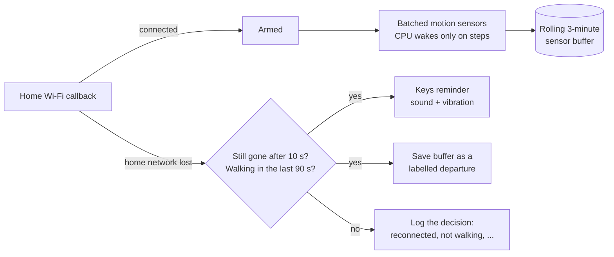

# Doorstep

[](https://github.com/boii0boii/doorstep/actions/workflows/ci.yml)
[](LICENSE)

Doorstep uses the phone already in your pocket to notice you're leaving home and remind you to take your keys. No tags or hardware needed.

**[One-page project memo](https://claude.ai/artifact/4m6TwFnR47uz5YJkQtwmMw)** · **[Architecture and design decisions](docs/ARCHITECTURE.md)**

<p>
  
  &nbsp;
  
</p>

## The problem

Getting locked out happens because nothing stops you at the moment you leave. Bluetooth trackers can warn you, but only if you bought a tag, attached it to your keys and kept it charged. Doorstep tries to do the same job with sensors the phone already has, while the phone stays locked in your pocket.

That rules out the obvious approaches:

- **GPS can't find a door.** Indoor fixes in a pocket are typically off by 10–50 m.
- **OS geofences are coarse and late.** They are reliable at around 100–150 m and can fire minutes after the event.
- **Apps normally stop receiving sensor data** once the screen locks.
- **False alarms and battery drain** get the app uninstalled.

## How it works

Doorstep combines two signals that are cheap to read while the phone is locked. Neither is enough on its own; together they are specific:

- **Home Wi-Fi** shows you're home. When it drops and doesn't come back, you've probably left.
- **Walking**, from the low-power step detector, separates leaving from a router restart while the phone sits on a table.



- **Runs while locked.** A foreground service keeps motion sensors registered in hardware-batched mode, so the sensor hub samples while the CPU sleeps. A wake-up step detector brings the CPU up only while you're walking.
- **Guards against false alerts.** No alert if you weren't walking, if Wi-Fi comes back within the grace period, if you arrived home less than 3 minutes ago, or within 10 minutes of the last alert.
- **Labels its own training data.** Each alert saves the two minutes of motion before it as a `Departure (auto)` recording. That window contains the real walk to the door and through it, so positive examples collect themselves. Tapping **Not leaving** turns the recording into a negative example instead.

The current rule alerts shortly after you step outside, when the Wi-Fi drops. The next step is to train a small on-device model on the auto-collected departures so it can alert at the door, before you cross. [docs/ARCHITECTURE.md](docs/ARCHITECTURE.md) covers the power strategy, the decision parameters and the failure modes.

## Real sensor data

A real 10-second Door Crossing recording from a Pixel 8a, aligned to the moment MARK DOOR was pressed. The recording and the tools that made this plot are in the repo ([samples/](samples/README.md), [ml/](ml/README.md)).


Rotation settles right after the threshold, and the magnetic field shifts by about 14 µT on the approach. That's one recording, so it's a direction to explore, not a result. The same data turned up a practical constraint: the Pixel's step counter delivers in batches about 10 s late. That's why the monitor counts steps from the lower-latency step detector and looks back 90 s.

## Status

| | |
|---|---|
| ✅ Built | Android background departure monitor, keys notification, self-labelling recordings, manual Training and Test modes |
| ✅ Tested | 18 Kotlin tests, including real Pixel recordings replayed through the departure rule, plus 8 Python tests of the data tooling; full screen-locked flow checked on an emulator; CI runs both on every push |
| ⏳ Next | A week of real use on a Pixel 8a to measure alert delay, false alerts per day and battery cost. No real-world results yet |
| 🔜 Then | Train the at-the-door motion model offline, run it silently to measure it on the phone, then enable it; iOS after that |

## Repository layout

```
android/   Kotlin + Jetpack Compose app (the active platform)
  app/src/main/java/com/boii0boii/doorstep/
    monitor/   departure monitor service, decision rule, Wi-Fi watcher, notifications
    capture/   screen-off training recorder service
    sensors/   sensor registration and recording
    data/      recording schema, storage, ZIP export
    ui/        Compose screens
    location/  accuracy-aware GPS door check (diagnostic only)
ml/        Python tools: load, validate and plot exported recordings
samples/   two real Pixel 8a recordings
ios/       parked SwiftUI recorder prototype
docs/      architecture, original design plans, README images
```

## Build and run

Requirements: Android Studio (or JDK 17 plus Android SDK 35). Use a physical phone to test pocket behaviour; an emulator can't simulate walking.

```sh
cd android
./gradlew testDebugUnitTest   # unit tests
./gradlew assembleDebug       # app/build/outputs/apk/debug/app-debug.apk

cd ..
pip install -r ml/requirements.txt
python ml/report.py samples/recordings   # data-quality report on the sample recordings
```

On the phone: open **Test** and save your home Wi-Fi. Then open **Reminders** and tap **Turn on reminders**, and grant location access as **Allow all the time**. Android hides the Wi-Fi name from background apps without it. Also grant physical activity and notification access, and allow unrestricted battery use. [android/README.md](android/README.md) covers permissions, the recording format and the device test plan.

## Privacy

Everything stays on the phone. There's no account and no server, and the app doesn't request the `INTERNET` permission. The home network name and door location are never written into recordings or exports. Motion data leaves the device only when you export a ZIP yourself.

## License

[MIT](LICENSE) © 2026 Sahil Verma
