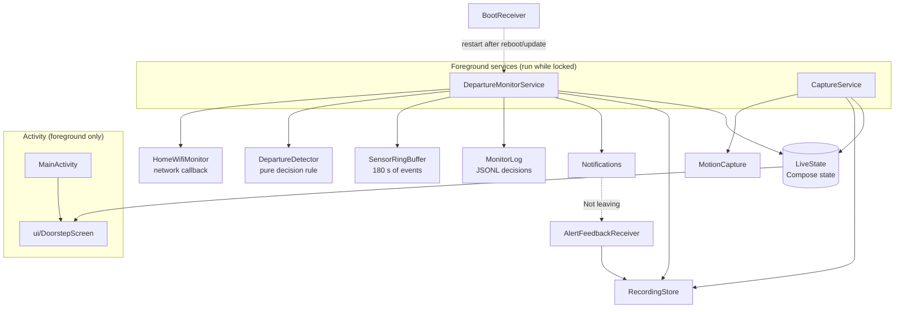

# Architecture

Doorstep's goal is to buzz you **at the door, before you step outside**, with the phone locked in your pocket, no extra hardware, little battery, and few false alarms.

The design has two layers:

- **The at-the-door alert (next).** A small on-device model recognises your own "leaving" motion pattern. It fires only when you're also on home Wi-Fi and near the saved door location.
- **What's built now, the foundation that feeds it.** A background monitor senses while locked. When home Wi-Fi drops while you're walking, it saves the preceding motion as an automatically labelled departure, which becomes training data for the model. It also sends a safety-net reminder, since by then you're already outside.

This document covers the built layer and the decisions behind it.

## Components

The Activity only shows state and starts or stops services. All sensing happens in the two foreground services, so it keeps running when the screen locks, the Activity is recreated, or the app is in the background. `LiveState` holds process-wide Compose state, so the UI picks up whatever the services are doing when it reopens.

## Key decisions

### 1. Which signals, and what each one is for

The at-the-door alert needs something that recognises the moment *before* you cross. Only a motion pattern can do that, so it is the deciding signal. Wi-Fi and location are there to confirm the context. For the built layer, the confirmed departure that labels the training data, these options were compared:

| Option | Role and limits |
|---|---|
| GPS radius at the door | Indoor fixes in a pocket are typically 10–50 m off, so it can't pinpoint a doorway alone. Kept as a supporting "near the door" signal for the at-the-door alert, with an accuracy-aware check (`distance + accuracy <= radius`). |
| OS geofence | Reliable at around 100–150 m and can fire minutes late. |
| BLE beacon / NFC tag | Needs extra hardware, which is what the product avoids. |
| **Wi-Fi drop + walking** | Cheap to observe while locked and highly specific. It's the ground truth that you left, but it arrives seconds to a minute after the door. That makes it the labeller and safety net, not the main alert. |

### 2. Low power while locked

- Sensors are registered **only while on home Wi-Fi**, or while a departure check is pending. Away from home, the only thing running is the network callback.
- Motion sensors use **hardware batching** (`maxReportLatencyUs = 1 s`). The sensor hub keeps sampling while the CPU sleeps. When the FIFO fills during sleep, the oldest events are dropped, so waking up gives the most recent seconds.
- A **wake-up step detector** wakes the CPU on steps. Each step extends a 30 s partial wake lock, and the first step after sleep flushes the FIFO so the seconds before it are kept. Devices without a wake-up step detector fall back to the significant-motion trigger.
- Both services use the `health` foreground-service type. The install-time `HIGH_SAMPLING_RATE_SENSORS` permission satisfies that type's requirement, so training recordings work even if activity recognition is denied.

### 3. Reading the Wi-Fi name in the background

Android hides the SSID unless the app has precise location, and hides it from background apps unless location is set to **Allow all the time**. `HomeWifiMonitor` registers a Wi-Fi `NetworkCallback` with `FLAG_INCLUDE_LOCATION_INFO`. If the name is hidden, its state is `UNKNOWN`, which never arms the monitor or triggers a departure.

### 4. The decision rule is pure Kotlin

`DepartureDetector` has no Android dependencies. The service feeds it steps and Wi-Fi transitions as `elapsedRealtimeNanos` values, and asks it for a decision once the grace period ends. That makes it testable with synthetic scenarios (`DepartureDetectorTest`) and by replaying real recordings (`RealRecordingReplayTest`).

| Parameter | Value | Purpose |
|---|---|---|
| Reconnect grace | 10 s | Ignore brief Wi-Fi drops |
| Walking lookback | 90 s before loss (+ grace) | Covers the walk to the door and through it |
| Minimum steps | 8 | Separates walking from a phone lying still |
| Minimum time home | 3 min | No alert when stepping back out right after arriving |
| Cooldown | 10 min | At most one alert per departure |

A brief drop does not reset the "time at home" clock, so a flaky router doesn't suppress the next real departure.

### 5. Recordings label themselves

The ring buffer always holds the last 180 s of events while armed. On an alert, the 120 s before the Wi-Fi loss plus the grace period are saved as a `Departure (auto)` recording (schema v2, `captureMode: auto-departure`, with the loss time). The notification's **Not leaving** action relabels it as `Normal Movement`, which makes it a hard negative example. The user can tap that before the recording has finished saving, so the answer is stored as a marker file and applied by whichever step finishes last, under a shared lock.

These recordings are the training set for the next stage: a small on-device model that recognises the walk to the door and can alert before the user crosses it.

### 6. Time

Every sample keeps `SensorEvent.timestamp`, the monotonic `elapsedRealtimeNanos`. UTC timestamps are derived from a single wall-clock anchor, never from when the callback ran, so batched and flushed events line up correctly.

## Failure modes

| Situation | Behaviour |
|---|---|
| Router restarts while the phone sits still | `NOT_WALKING`, no alert |
| Wi-Fi drops briefly while moving around the house | `RECONNECTED`, no alert |
| Leave again within 3 min of arriving | `JUST_ARRIVED`, no alert |
| Background location not granted, or system Location off | Wi-Fi name unavailable, monitor never arms, and the status screen says why |
| Notifications denied | Decision still logged and recording saved; no alert posted |
| Reboot or app update | `BootReceiver` restarts the monitor if it was on |
| Aggressive OEM battery manager | Can still kill the service; the app asks for unrestricted battery use |
| Phone left at home while the user leaves | Missed, since the phone never leaves. This is inherent to a phone-only design |

## What the real data showed

Replaying the two Pixel 8a sample recordings ([samples/](../samples/README.md)) showed that the **step counter delivers in batches about 10 s late**. A 10-second clip ends with no counted steps in its final seconds. That's why the monitor counts steps from the step detector, flushes the sensor FIFO when it wakes, and looks back 90 s rather than a few seconds.

## Limitations and next steps

- The built reminder is a safety net that fires after the user steps outside. The at-the-door alert (pattern + home Wi-Fi + door location) depends on training the motion model on auto-collected departures.
- The app can't tell whether the user already has their keys, so it reminds on every departure. Learning when to stay quiet is an open question.
- Alert delay, false alerts per day and battery cost have not been measured on a real phone yet. That's the next milestone.
